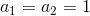

# Step0

## Lecture01


### 課題

#### 記述問題

1. 名前空間とは何か説明しなさい。
2. クラスとは何か説明しなさい。
3. オブジェクトとは何か説明しなさい。
4. 継承とは何か説明しなさい。
5. メソッドとは何か説明しなさい。
6. アクセス指定子とは何か説明しなさい。C#にはどんな種類があるか答えなさい。(最低4つ)
7. プロパティとは何か説明しなさい。
8. フィールドとは何か説明しなさい。
9. コンストラクタとは何か説明しなさい。

参考:

https://docs.microsoft.com/ja-jp/dotnet/csharp/

http://ufcpp.net/study/csharp/

https://qiita.com/toshi0607/items/801a0d37fb48313cbdbd


#### 実践問題

C#で電卓を作りなさい。

以下の仕様の通りとすること。

##### 前提条件

- コンソールアプリケーション(.NET Framework)で作成すること。
- .NET Frameworkのバージョンは4.6.2とする。
- Project名はCalculatorとすること。

##### 機能要件

以下の計算ができること。

1. 四則演算
2. 平方の計算
3. ルートの計算
4. べき乗の計算 (底は整数、べき数は正の整数とする)
5. 階乗の計算 (正の整数の階乗に対応すること)
6. 三角関数の計算(sin, cos, tan) (各関数の引数は角度(degree)とすること)
7. フィボナッチ数列の計算 (Fibonacci(p) と入力すると、p番目までの結果が表示されること)(参考：https://ja.wikipedia.org/wiki/%E3%83%95%E3%82%A3%E3%83%9C%E3%83%8A%E3%83%83%E3%83%81%E6%95%B0, https://www.studyplus.jp/445)
<ol style="background:#ffffff">
<br />

</ol>

8. historyコマンドを入力したら、コンソール画面上に入力した履歴とその出力が表示されること。(historyと入力したら履歴とその出力が表示される。コンソールアプリケーションの起動からコマンドを入力するまでの履歴とそので良い)
9. historyコマンドにオプション--logを入力したら、Exeと同階層にLogフォルダが作成され、コンソール画面上に入力した履歴とその出力内容が[yyyyMMddhhmmss].logというファイルが作成されること
    - 具体的には、> history --log と入力する。historyと--logの間に2つ以上のスペースがあっても実行されること。
    - [yyyyMMddhhmmss]は、日付日時のFormatとする

※小数点以下第3位まで精度が正しければよい

以下の通りの動作をすること。

````
> 1+1
2
> 5-1
4
> -5*4
20
> -5/4
-1.25
> 8^2
64
> sqrt(2)
1.41
> 3^5
243
> 5!
120
> sin(30)
0.500
> Fibonacci(10)
1
1
2
3
5
8
13
21
34
55
> history
1+1
2
5-1
4
-5*4
20
-5/4
-1.25
8^2
64
sqrt(2)
1.41
3^5
243
5!
120
sin(30)
0.500
Fibonacci(10)
1
1
2
3
5
8
13
21
34
55
````

##### 非機能要件

1. 保守性を高めるため、Utility Classなどを作成し、機能要件の1～7は個別の関数(Method)を定義すること。
2. 計算不能な入力があったとしても、アプリケーションでエラーメッセージを表示し、アプリケーションが強制的に終了することがないようにする。try,catchなどを利用すること。(可用性)
3. 記述問題の各項目について実践問題で実装したプログラムにコメントアウトでどの部分にあたるか記載しなさい。
    - 例: 2のクラスなら以下の通りとする

    ````
    public class Person {  //2. クラス
        public string Name { get; set; }
    }
    ````
